# Proyecto BDG – OLTP enriquecido + Data Warehouse-Informe

**Autores:** Alex Guamán, Daniel Guanga, José Vanegas, Miguel Vanegas  
**Materia:** Gestion de Bases de Datos 
**Ingeniero:** German Ernesto Parra Gonzalez
**Trabajo:** Realizacion de un OLAP  

---

## 1. Resumen ejecutivo (propósito académico)

Este proyecto construye un ecosistema de datos completo:

1. Un **modelo OLTP** (CLIENTES, PRODUCTOS, ORDENES, DETALLE_ORDENES).  
2. Un módulo de **ubicación** con tabla `CIUDAD` y la jerarquía oficial de Ecuador: `PROVINCIAS`, `CANTONES`, `PARROQUIAS`. Los catálogos geográficos se obtienen desde GeoNames y desde dumps oficiales.  
3. Un **Data Warehouse (DW)** con esquema en estrella: dimensiones **Tiempo**, **Categoría**, **Producto**, **Ubicación** (provincia + ciudad) y la tabla de hechos **DW_FACT_VENTAS**.  
4. Un **ETL** que transforma y carga datos desde OLTP hacia DW; la vista `VW_MAS_VENDIDO` extrae el producto más vendido por fecha/categoría/provincia/ciudad.  
5. Un **plan de ejecución único** (`data/output/plan_ejecucion_dw.sql`) que orquesta todo.

Este documento tiene un enfoque académico: define objetivos, describe metodología, provee comandos reproducibles, justifica decisiones de diseño y facilita la evaluación.

---

## 2. Fuentes de datos y referencias

- **GeoNames (Ecuador)** — dump `EC.txt` / `EC.zip`: catálogo de localidades (ciudades).  
- **Repositorio Datos-Geograficos-Ecuador** — SQL/CSV oficiales con provincias/cantones/parroquias.  
- **Censo 2016 (PDF)** — referencia oficial para validación de jerarquía.

Archivos relevantes en el proyecto:

```
data/raw/ciudades/
data/raw/jerarquia/
data/Datos-Geograficos-Ecuador/
data/output/ciudades/
data/output/jerarquia/
data/output/plan_ejecucion_dw.sql
```

---

## 3. Arquitectura y flujo (pipeline)

### 3.1 Componentes
- **OLTP**: tablas transaccionales (CLIENTES, PRODUCTOS, ORDENES, DETALLE_ORDENES).
- **Catálogo geográfico**: CIUDAD + jerarquía PROVINCIAS/CANTONES/PARROQUIAS.
- **DW**: dimensiones (TIEMPO, CATEGORIA, PRODUCTO, UBICACION) y hecho (DW_FACT_VENTAS).
- **ETL**: scripts SQL que usan `MERGE`, agregaciones y `INSERT /*+ APPEND */` para cargas masivas.
- **Scripts Python**: descargan y normalizan catálogos; generan scripts SQL idempotentes y el plan maestro.

### 3.2 Flujo de alto nivel
1. Descargar y normalizar GeoNames → `insert_ciudad.sql`.  
2. Transformar dumps oficiales en CSV jerárquicos.  
3. Generar `plan_ejecucion_dw.sql`.  
4. Ejecutar plan en Oracle (`sqlplus usuario/clave@tns @data/output/plan_ejecucion_dw.sql`).  
5. Validar resultados con consultas SQL.

---

## 4. Estructura de carpetas (resumen)

- `data/raw/ciudades/` — GeoNames, `EC.txt`, `admin1CodesASCII.txt`.  
- `data/raw/jerarquia/` — CSV intermedios.  
- `data/output/ciudades/` — `ciudades_ec.csv`, `insert_ciudad.sql`.  
- `data/output/jerarquia/` — `insert_jerarquia.sql`.  
- `data/output/plan_ejecucion_dw.sql` — plan maestro.  
- `scripts/python/` — utilidades para descargas, parseo y generación de planes.  
- `scripts/sql/oltp/` — DDL/PLSQL OLTP y geografía.  
- `scripts/sql/dw/` — definición DW y vista `VW_MAS_VENDIDO`.  
- `scripts/sql/etl/` — cargas idempotentes (MERGE) y hecho.  

---

## 5. Descripción de objetos principales (esquema)

### OLTP
- `CLIENTES` (clienteid PK, nombre, apellido, telefono, ciudadid FK)  
- `PRODUCTOS` (productoid PK, descripcion, categoria, precio)  
- `ORDENES` (ordenid PK, fechaorden, clientes_clienteid FK)  
- `DETALLE_ORDENES` (detalleid PK, ordenes_ordenid FK, productos_productoid FK, cantidad, precio_unitario, descuento)

### Geografía
- `CIUDAD` (ciudadid PK, nombre, provincia, latitud, longitud, zona_horaria)  
- `PROVINCIAS` (provinciaid PK, nombre)  
- `CANTONES` (cantonid PK, nombre, provinciaid FK)  
- `PARROQUIAS` (parroquiaid PK, nombre, cantonid FK)

### Data Warehouse (esquema estrella)
- `DW_DIM_TIEMPO` (fecha_id PK, fecha, anio, mes, dia, trimestre, dia_semana, etc.)  
- `DW_DIM_CATEGORIA` (categoria_id PK, nombre)  
- `DW_DIM_PRODUCTO` (producto_id PK, producto_natural_id, nombre, categoria_id, precio)  
- `DW_DIM_UBICACION` (ubicacion_id PK, provincia, ciudad, fila_desconocida_flag)  
- `DW_FACT_VENTAS` (fact_id PK, fecha_id FK, producto_id FK, ubicacion_id FK, cantidad, total_bruto, total_neto, descuento)

---

## 6. Scripts clave y su propósito

### Python
- `scripts/python/download_ecuador_cities.py` — descarga y parsea GeoNames; genera `ciudades_ec.csv` y `insert_ciudad.sql`.  
- `scripts/python/jerarquia/build_jerarquia_csv.py` — parsea dumps oficiales y genera CSV jerárquicos.  
- `scripts/python/jerarquia/generate_jerarquia_inserts.py` — genera `insert_jerarquia.sql` idempotente.  
- `scripts/python/run_full_etl_pipeline.py` — orquesta la creación del plan `plan_ejecucion_dw.sql`.  

### SQL OLTP
- `00_create_base_tables.sql` — crea CLIENTES, PRODUCTOS, ORDENES, DETALLE_ORDENES (si no existen).  
- `00_require_base_tables.sql` — valida existencia de tablas base.  
- `01_create_ciudad_table.sql` — crea CIUDAD, secuencia y trigger.  
- `02_add_ciudad_to_clientes.sql` — agrega CIUDADID y FK a CLIENTES.  
- `03_assign_random_city_to_clients.sql` — asigna ciudad a clientes sin ciudad.  
- `04_create_province_canton_parish_tables.sql` — crea PROVINCIAS/CANTONES/PARROQUIAS.  
- `05_seed_transactional_data.sql` — inserciones semilla controladas (si tablas vacías).

### SQL DW / ETL
- `scripts/sql/dw/01_dw_star_schema_and_top_product_view.sql` — crea dimensiones, hecho y la vista `VW_MAS_VENDIDO`.  
- `scripts/sql/etl/load_dw_from_oltp.sql` — MERGE para dimensiones; carga de `DW_FACT_VENTAS`.  

---

## 7. Comandos de ejecución (reproducibles)

### Generar catálogo de ciudades (local o remoto)
```bash
python ./scripts/python/download_ecuador_cities.py
# o usando archivo local
python ./scripts/python/download_ecuador_cities.py --source ./data/raw/ciudades/EC.txt
```

### Generar plan maestro
```bash
python ./scripts/python/run_full_etl_pipeline.py
# Omitir regeneración de ciudades
python ./scripts/python/run_full_etl_pipeline.py --skip-cities
```

### Ejecutar todo en Oracle (modo batch)
```sql
sqlplus usuario/clave@tns @data/output/plan_ejecucion_dw.sql
```

> **Nota:** Si las tablas pertenecen a otro esquema, antes de ejecutar:
```sql
ALTER SESSION SET CURRENT_SCHEMA = TU_ESQUEMA;
```

---

## 8. Consultas de verificación y monitoreo (recomendadas)

Ejecútalas tras el plan para validar integridad y contenido.

### Conteos generales
```sql
SELECT COUNT(*) AS CLIENTES FROM CLIENTES;
SELECT COUNT(*) AS PRODUCTOS FROM PRODUCTOS;
SELECT COUNT(*) AS ORDENES FROM ORDENES;
SELECT COUNT(*) AS DETALLES FROM DETALLE_ORDENES;
SELECT COUNT(*) AS CIUDADES FROM CIUDAD;
SELECT COUNT(*) AS PROVINCIAS FROM PROVINCIAS;
SELECT COUNT(*) AS CANTONES FROM CANTONES;
SELECT COUNT(*) AS PARROQUIAS FROM PARROQUIAS;
SELECT COUNT(*) AS DIM_UBICACION FROM DW_DIM_UBICACION;
SELECT COUNT(*) AS FACT_VENTAS FROM DW_FACT_VENTAS;
```
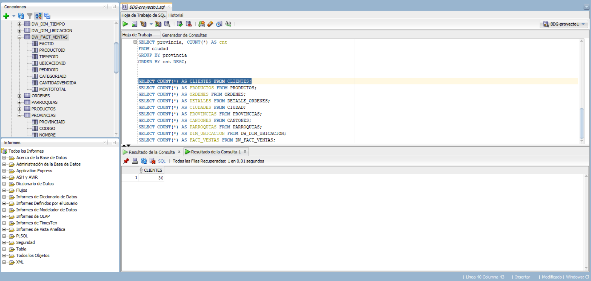


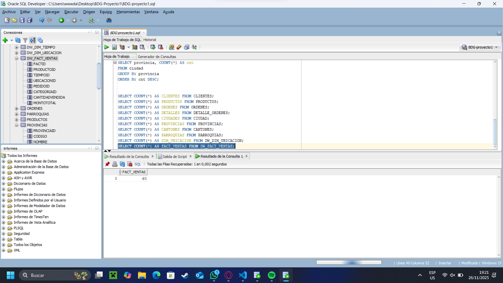

### Ejemplos y muestras

```sql
-- 10 ciudades de ejemplo
SELECT ciudadid, nombre, provincia FROM ciudad FETCH FIRST 10 ROWS ONLY;

-- Clientes sin ciudad
SELECT COUNT(*) FROM clientes WHERE ciudadid IS NULL;

-- Asignaciones de clientes con ciudad
SELECT cl.clienteid, cl.nombre, ci.nombre AS ciudad
FROM clientes cl JOIN ciudad ci ON cl.ciudadid = ci.ciudadid
FETCH FIRST 10 ROWS ONLY;

-- Top 10 productos más vendidos
SELECT p.productoid, p.descripcion, SUM(d.cantidad) total_vendido
FROM productos p JOIN detalle_ordenes d ON p.productoid = d.productos_productoid
GROUP BY p.productoid, p.descripcion
ORDER BY total_vendido DESC
FETCH FIRST 10 ROWS ONLY;

-- Ejemplo: productos top por fecha (DW)
SELECT * FROM VW_MAS_VENDIDO WHERE ROWNUM <= 10;

-- Ventas por provincia (DW)
SELECT u.provincia, SUM(f.montototal) total_ventas
FROM dw_fact_ventas f JOIN dw_dim_ubicacion u ON f.ubicacionid = u.ubicacionid
GROUP BY u.provincia ORDER BY total_ventas DESC;
```
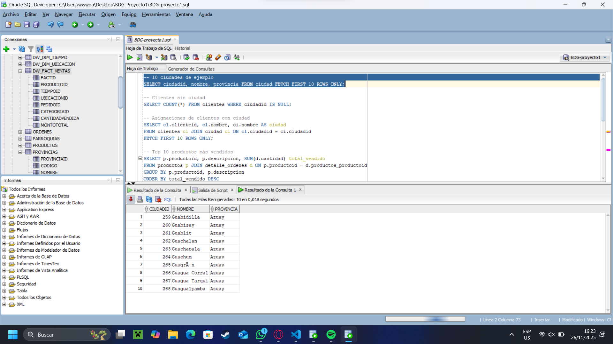

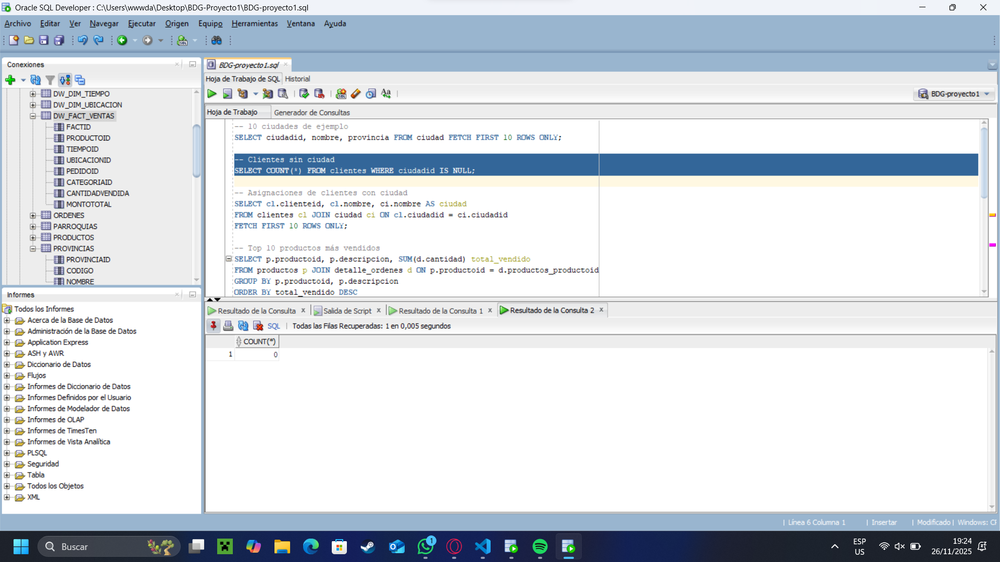

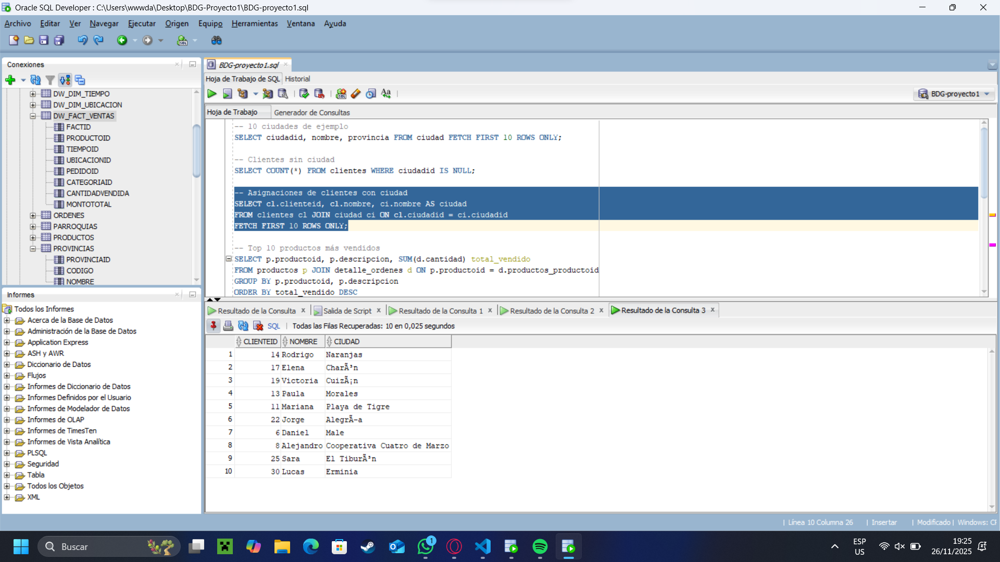

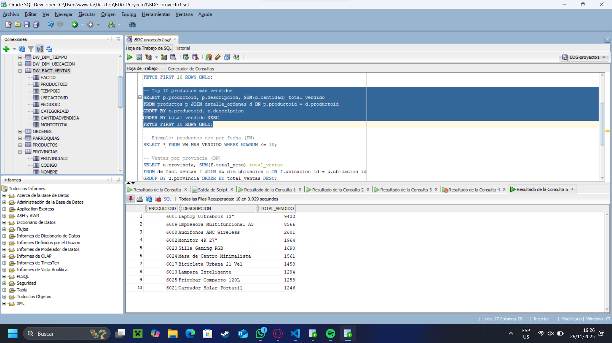

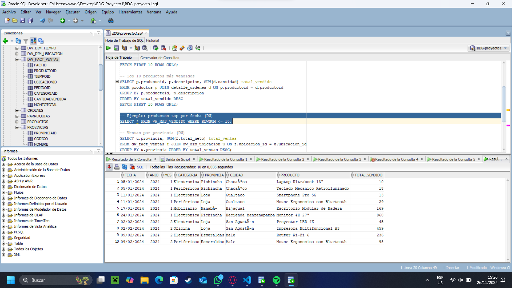


---

## 9. Procedimientos y funciones PL/SQL (ejemplos operativos)

> A continuación se incluyen procedimientos listos para ejecutar en tu esquema. Pégalos en SQL*Plus con `SET SERVEROUTPUT ON`.

### 9.1 Producto más vendido (país)
```sql
CREATE OR REPLACE PROCEDURE PRD_MAS_VENDIDO_PAIS(
    prodID OUT NUMBER,
    descripcion OUT VARCHAR2,
    total_vendido OUT NUMBER
) IS
BEGIN
    SELECT productoid, descripcion, total_cant
    INTO prodID, descripcion, total_vendido
    FROM (
        SELECT p.productoid, p.descripcion, SUM(d.cantidad) AS total_cant
        FROM productos p
        JOIN detalle_ordenes d ON p.productoid = d.productoid
        GROUP BY p.productoid, p.descripcion
        ORDER BY SUM(d.cantidad) DESC
    )
    WHERE ROWNUM = 1;
EXCEPTION
    WHEN NO_DATA_FOUND THEN
        prodID := NULL; descripcion := 'SIN DATOS'; total_vendido := 0;
END;
/
```
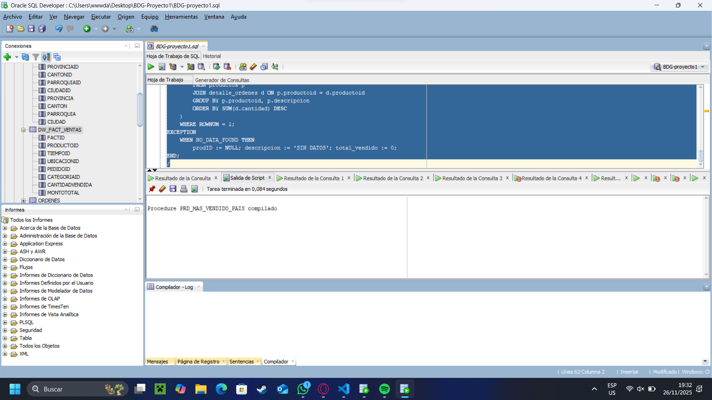

### 9.2 Producto más vendido por ciudad
```sql
CREATE OR REPLACE PROCEDURE PRD_MAS_VENDIDO_CIUDAD(
    nombre_ciudad IN VARCHAR2,
    prodID OUT NUMBER,
    descripcion OUT VARCHAR2,
    total_vendido OUT NUMBER
) IS
BEGIN
    SELECT productoid, descripcion, total_cant
    INTO prodID, descripcion, total_vendido
    FROM (
        SELECT p.productoid, p.descripcion, SUM(d.cantidad) AS total_cant
        FROM productos p
        JOIN detalle_ordenes d ON p.productoid = d.productoid
        JOIN ordenes o ON d.ordenes_ordenid = o.ordenid
        JOIN clientes c ON o.clientes_clienteid = c.clienteid
        JOIN ciudad ci ON c.ciudadid = ci.ciudadid
        WHERE LOWER(ci.nombre) = LOWER(nombre_ciudad)
        GROUP BY p.productoid, p.descripcion
        ORDER BY SUM(d.cantidad) DESC
    )
    WHERE ROWNUM = 1;
EXCEPTION
    WHEN NO_DATA_FOUND THEN
        prodID := NULL; descripcion := 'NO HAY VENTAS'; total_vendido := 0;
END;
/
```

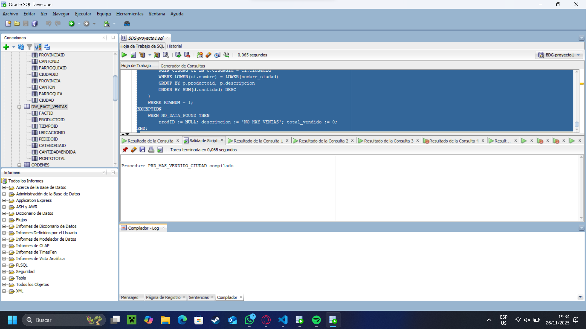

### 9.3 Ciudad con más clientes
```sql
CREATE OR REPLACE PROCEDURE CIUDAD_MAS_CLIENTES(
    ciudad OUT VARCHAR2,
    total OUT NUMBER
) IS
BEGIN
    SELECT nombre, total_clientes INTO ciudad, total FROM (
        SELECT ci.nombre AS nombre, COUNT(*) AS total_clientes
        FROM ciudad ci JOIN clientes cl ON cl.ciudadid = ci.ciudadid
        GROUP BY ci.nombre ORDER BY COUNT(*) DESC
    ) WHERE ROWNUM = 1;
EXCEPTION
    WHEN NO_DATA_FOUND THEN ciudad := 'N/A'; total := 0;
END;
/
```

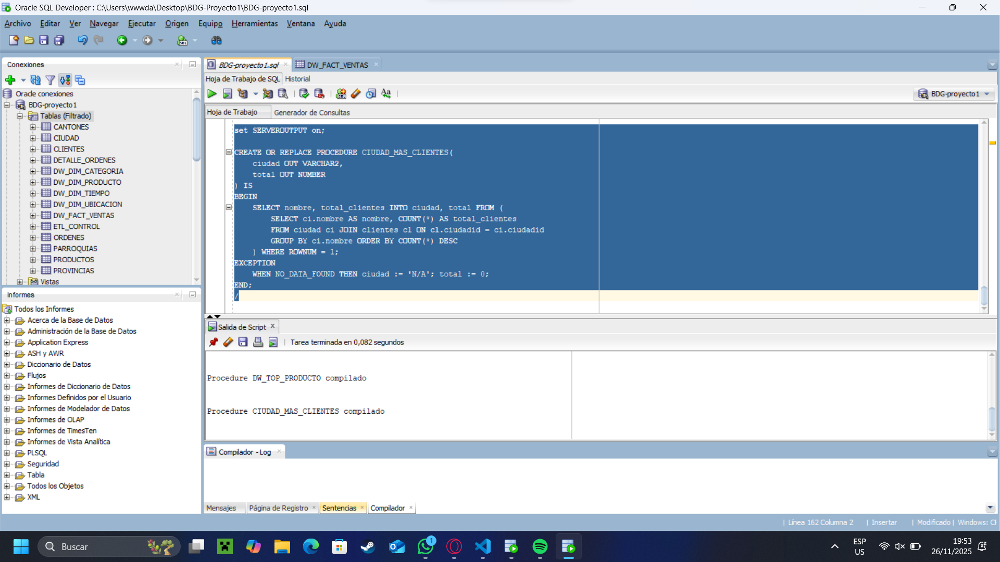

### 9.4 Top producto desde el DW (VW_MAS_VENDIDO)
```sql
CREATE OR REPLACE PROCEDURE DW_TOP_PRODUCTO(
    fecha IN DATE,
    categoria IN VARCHAR2,
    ciudad IN VARCHAR2,
    producto OUT VARCHAR2,
    total_vendido OUT NUMBER
) IS
BEGIN
    SELECT producto, total_vendido INTO producto, total_vendido
    FROM vw_mas_vendido
    WHERE fecha = TRUNC(fecha) AND LOWER(categoria) = LOWER(categoria) AND LOWER(ciudad) = LOWER(ciudad)
    FETCH FIRST 1 ROWS ONLY;
EXCEPTION
    WHEN NO_DATA_FOUND THEN producto := 'N/A'; total_vendido := 0;
END;
/
```
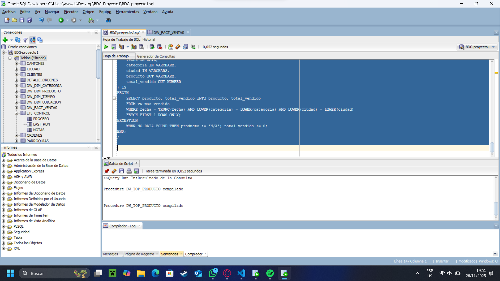

> **Ejecución de ejemplo** (consulte `DBMS_OUTPUT`):
```sql
SET SERVEROUTPUT ON;
DECLARE
  v_prod NUMBER;
  v_desc VARCHAR2(4000);
  v_total NUMBER;
BEGIN
  PRD_MAS_VENDIDO_PAIS(v_prod, v_desc, v_total);
  DBMS_OUTPUT.PUT_LINE('Top product id: '||v_prod||' desc: '||v_desc||' total: '||v_total);
END;
/
```
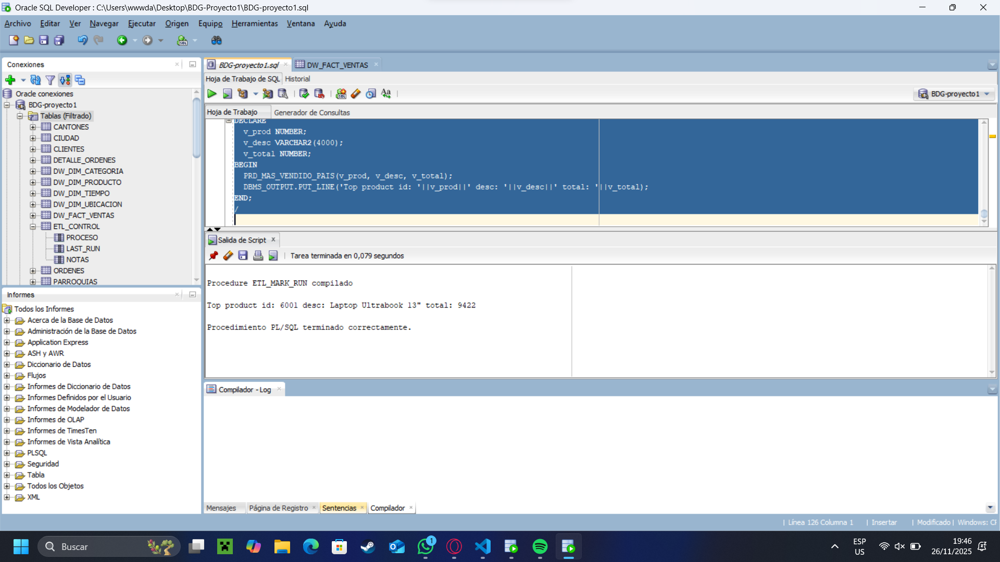
---

## 10. Estrategias de carga masiva y rendimiento

1. **External tables**: preferible para CSV grandes; luego `INSERT /*+ APPEND */ SELECT * FROM ext_table`.  
2. **SQL*Loader (DIRECT PATH)**: control file + `DIRECT=TRUE` para performance.  
3. **DROP/CREATE índices alrededor de cargas masivas**: recrearlos después para acelerar inserciones.  
4. **Paralelismo**: `INSERT /*+ APPEND PARALLEL(t,4) */` si hardware lo permite.  
5. **Recolectar estadísticas**: `DBMS_STATS.GATHER_SCHEMA_STATS` tras cargas grandes.  
6. **Considerar particionado por fecha** en `DW_FACT_VENTAS` cuando el volumen aumente.

---

## 11. ETL incremental y control de ejecuciones

- Mantener una tabla de control `ETL_CONTROL(proceso, last_run, notas)`.  
- Registrar `last_run` tras cada ejecución exitosa.  
- El ETL de hechos debe usar la condición `WHERE fecha_orden > last_run` para procesamiento incremental.

Ejemplo de tabla y procedimiento:
```sql
CREATE TABLE etl_control (
  proceso VARCHAR2(100) PRIMARY KEY,
  last_run DATE,
  notas VARCHAR2(4000)
);
-- Procedimiento simple para marcar ejecución
CREATE OR REPLACE PROCEDURE etl_mark_run(p_proceso VARCHAR2) IS
BEGIN
  MERGE INTO etl_control c USING (SELECT p_proceso proceso, SYSTIMESTAMP last_run FROM dual) s
  ON (c.proceso = s.proceso)
  WHEN MATCHED THEN UPDATE SET last_run = s.last_run
  WHEN NOT MATCHED THEN INSERT (proceso, last_run) VALUES (s.proceso, s.last_run);
  COMMIT;
END;
/
```
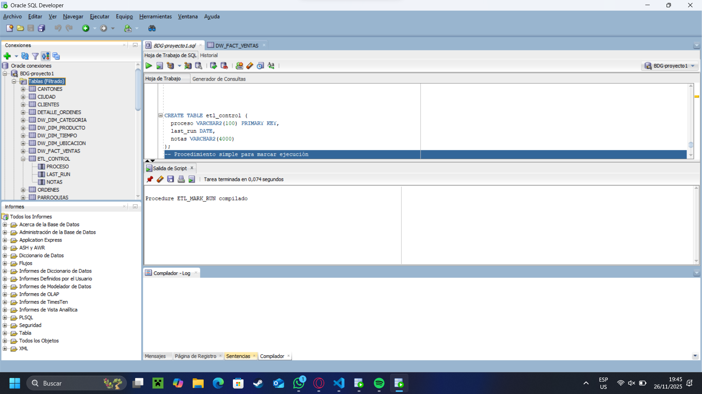

---

## 12. Validaciones y comprobaciones (post-ETL)

- `SELECT COUNT(*) FROM DW_DIM_UBICACION;` → debe incluir 'DESCONOCIDA'.  
- `SELECT COUNT(*) FROM DW_DIM_TIEMPO;` → fechas derivadas de ORDENES.  
- `SELECT COUNT(*) FROM DW_FACT_VENTAS;` → > 0 si hay órdenes.  
- Comparar sumas: `SUM(detalle_ordenes.cantidad * precio_unitario * (1-descuento))` vs `SUM(dw_fact_ventas.total_neto)`.  

Consultas de control:
```sql
-- Diferencias entre OLTP y DW
SELECT 
 (SELECT SUM(d.cantidad * d.preciounit FROM detalle_ordenes d) total_oltp,
 (SELECT SUM(f.montototal) FROM dw_fact_ventas f) total_dw
FROM dual;
```
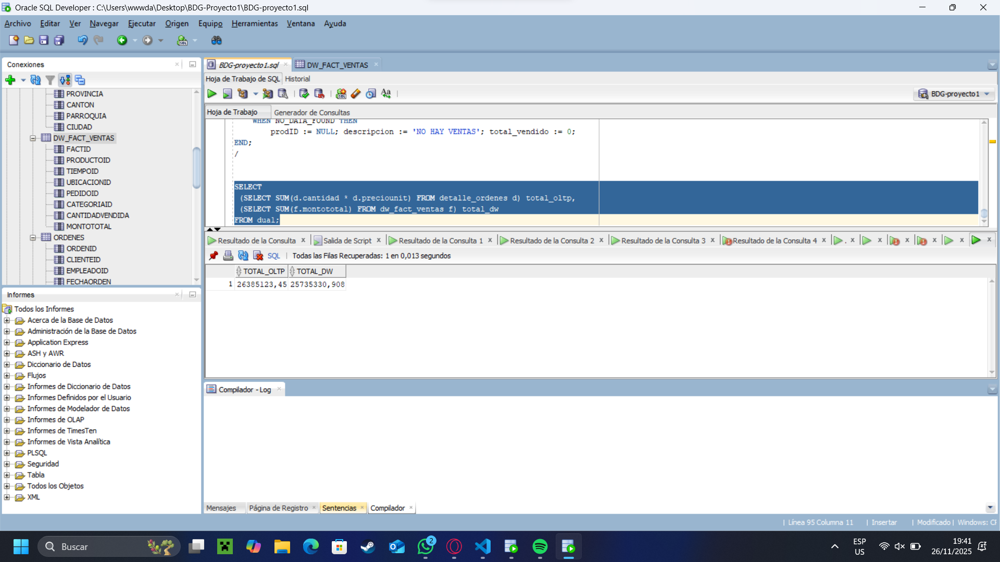

## 13. Troubleshooting y recomendaciones

- **ORA-00942 (table or view does not exist)**: ejecute `ALTER SESSION SET CURRENT_SCHEMA=...` o corrija el esquema del usuario.  
- **Carga lenta**: use direct-path loads, reduzca logging, revise índices.  
- **Inconsistencias en jerarquía**: valide CSV generados con el PDF del censo y con `admin1CodesASCII.txt`.  
- **Repetición de ejecuciones**: todos los scripts DW y ETL usan `MERGE` para idempotencia; `insert_ciudad.sql` puede volver a correr si previamente se limpió la tabla.

---

## 14. Notas académicas (justificación de diseño)

1. **Separación OLTP/DW**: evita que consultas analíticas afecten la transaccionalidad.  
2. **Dimensión Ubicación**: desagregada en provincia + ciudad para análisis geoespaciales y agregaciones a distintos niveles.  
3. **MERGE en dimensiones**: permite idempotencia y fácil re-ejecución del ETL.  
4. **Fila 'DESCONOCIDA'**: manejo de valores nulos o clientes sin ciudad asignada.  
5. **Materialización de la vista 'VW_MAS_VENDIDO'**: opcionalmente, usar vista materializada si el cálculo es costoso y los datos se actualizan periódicamente.  
6. **Hash/determinismo en asignación aleatoria**: al usar ORA_HASH/MD5 sobre clienteid se garantiza reproducibilidad y distribución uniforme.

---

## 15. Lista de scripts (resumen rápido)

- `scripts/python/download_ecuador_cities.py`  
- `scripts/python/jerarquia/build_jerarquia_csv.py`  
- `scripts/python/jerarquia/generate_jerarquia_inserts.py`  
- `scripts/python/run_full_etl_pipeline.py`  
- `scripts/sql/oltp/00_create_base_tables.sql`  
- `scripts/sql/oltp/00_require_base_tables.sql`  
- `scripts/sql/oltp/01_create_ciudad_table.sql`  
- `scripts/sql/oltp/02_add_ciudad_to_clientes.sql`  
- `scripts/sql/oltp/03_assign_random_city_to_clients.sql`  
- `scripts/sql/oltp/04_create_province_canton_parish_tables.sql`  
- `scripts/sql/oltp/05_seed_transactional_data.sql`  
- `scripts/sql/dw/01_dw_star_schema_and_top_product_view.sql`  
- `scripts/sql/etl/load_dw_from_oltp.sql`  

---

## 16. Próximos pasos sugeridos para evaluación académica

1. **Prueba de integridad**: elaborar tests unitarios SQL que verifiquen FK, counts y distribuciones.  
2. **Benchmark de carga**: medir tiempos de carga (external table vs SQL*Loader) con ~9000 ciudades.  
3. **Análisis de escalado**: particionar `DW_FACT_VENTAS` por rango de fechas y comparar planes de ejecución.  
4. **Materializar `VW_MAS_VENDIDO`** con refresh programado y medir ganancia.  
5. **Visualizaciones**: exportar `VW_MAS_VENDIDO` a PowerBI/Metabase para análisis exploratorio.

---


